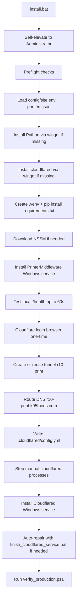

# Printer Middleware — Installation Guide (Production PC)

Complete hand-holding guide for installing on a Windows print-site PC **without Git**.

**Public URL:** `https://r10-print.k95foods.com`  
**Local port:** `5001`  
**One-click installer:** `install.bat`

For a shorter checklist, see [DEPLOYMENT_CHECKLIST.md](DEPLOYMENT_CHECKLIST.md).

---

## 1. What `install.bat` does



### Software installed automatically

| Component | Method | Purpose |
|-----------|--------|---------|
| Python 3.11 | winget | Runs the app |
| cloudflared | winget | Public HTTPS tunnel |
| Flask + deps | pip in `.venv` | App libraries |
| NSSM | downloaded to project folder | Windows service wrapper |
| PrinterMiddleware service | NSSM | App auto-start + crash restart |
| Cloudflared service | cloudflared MSI | Tunnel auto-start + crash restart |

### Not installed (by design)

| Component | Why | Alternative |
|-----------|-----|-------------|
| Git | Not needed to run the app | Download ZIP or `update-without-git.bat` |
| IDE / Node.js | Not needed on production PC | — |

---

## 2. Before you start

- [ ] Windows 10/11 PC on the **same LAN as printers**
- [ ] **Administrator** access
- [ ] Internet access
- [ ] Cloudflare login for **`k95foods.com`**
- [ ] Printer IP addresses and ports (usually `2030`)
- [ ] Only **one PC** running `r10-print.k95foods.com` at a time

Optional: BIOS **Restore on AC Power Loss** if the site must recover after power cuts.

---

## 3. Get the app onto the PC (no Git)

### Option A — Browser ZIP (recommended)

1. Download: https://github.com/Data-Analyst4/printer-middleware/archive/refs/heads/develop.zip
2. Extract to `C:\printer-middleware`
3. If folder is named `printer-middleware-develop`, rename it:

```cmd
move C:\printer-middleware-develop C:\printer-middleware
```

### Option B — Bootstrap script (if you already have one file from USB)

```cmd
bootstrap.bat
```

### Option C — PowerShell one-liner

See [update-without-git.bat](update-without-git.bat) or Section 8 below.

**Do not use `git pull` unless Git is installed and the folder is a git clone.**

---

## 4. Configure printers

```cmd
cd C:\printer-middleware
copy config\printers.json.example config\printers.json
notepad config\printers.json
```

Example:

```json
{
  "P1": { "ip": "192.168.29.110", "port": 2030 },
  "P3": { "ip": "192.168.29.110", "port": 2030 }
}
```

Optional site settings:

```cmd
copy config\site.env.example config\site.env
notepad config\site.env
```

Defaults: port `5001`, hostname `r10-print.k95foods.com`.

---

## 5. Run install

**Use Administrator Command Prompt** (recommended):

```cmd
cd /d C:\printer-middleware
install.bat
```

Or right-click `install.bat` → **Run as administrator**.

During install:

1. winget may install Python and cloudflared
2. Browser opens for **Cloudflare login** (one-time) — select `k95foods.com`
3. Installer creates tunnel, DNS, services, and runs verification

If install finishes with warnings, see Section 6.

---

## 6. Complete error catalog

### A. Getting the app onto the PC

| Error / symptom | Cause | Fix |
|-----------------|-------|-----|
| `'git' is not recognized` | Git not installed | Use ZIP download; do not use `git pull` |
| `not a git repository` | Folder from ZIP, not clone | Use ZIP download |
| `Missing main.py` | Incomplete extract | Re-download ZIP; extract full folder |
| Download ZIP fails | No internet / blocked GitHub | Fix network; try another connection |

### B. Running `install.bat`

| Error / symptom | Cause | Fix |
|-----------------|-------|-----|
| Install stops immediately, no admin | Not elevated | Run from **Admin CMD** or right-click → Run as administrator |
| `ExecutionPolicy` blocked | PowerShell policy | Installer already uses `-ExecutionPolicy Bypass`; run from CMD |
| `winget was not found` | Old Windows or winget removed | Install Python + cloudflared manually, then rerun `install.bat` |
| `Python not found` after winget | PATH not refreshed | Open **new Admin CMD**, rerun `install.bat` |
| `cloudflared is still missing after install` | winget installed it but PATH lagged | Use **latest ZIP** (has PATH fix); or verify: `"C:\Program Files (x86)\cloudflared\cloudflared.exe" --version` then rerun |
| `pip install` fails | No internet / proxy | Fix internet; rerun `install.bat` |
| Port 5001 already in use | Another app on 5001 | Change `PORT=5002` in `config\site.env`, rerun `install.bat` |
| `Python was not found` / WindowsApps python | Windows Store alias, not real Python | Install Python 3.11 via winget or python.org; disable App execution aliases for python.exe; delete `.venv`; rerun `install.bat` |
| `Python was not found` / WindowsApps python | Windows Store alias, not real Python | Install Python 3.11; disable App execution aliases for `python.exe`; delete `.venv`; rerun `install.bat` |
| `Virtualenv Python not found` | venv creation failed | Delete `.venv` folder, rerun `install.bat` |

### C. PrinterMiddleware service

| Error / symptom | Cause | Fix |
|-----------------|-------|-----|
| `install_middleware_service.bat failed` | Python/venv missing | Fix Section B, rerun |
| Health check failed on `127.0.0.1:5001/health` | Service did not start or needs more time | Run `repair-middleware.bat` as Admin, read `logs\service-error.log`, then `install_middleware_service.bat 5001`. If local health is OK, run `continue-install.bat` to finish Cloudflare only. |
| Service RUNNING but print fails | Wrong printer IP | Edit `config\printers.json`, restart service: `sc.exe stop PrinterMiddleware` then `sc.exe start PrinterMiddleware` |
| Old API on wrong port | Stale process | `netstat -ano \| findstr :5001` — stop other process or change port |

### D. Cloudflare login and tunnel

| Error / symptom | Cause | Fix |
|-----------------|-------|-----|
| Browser did not open for login | Blocked default browser | Run manually: `"C:\Program Files (x86)\cloudflared\cloudflared.exe" tunnel login` |
| `cert.pem missing` | Login not completed | Complete browser login; select `k95foods.com` zone |
| `tunnel create failed` | No Cloudflare access / wrong account | Use account that owns `k95foods.com` |
| DNS route warning / already exists | CNAME already present | Usually safe; continue if verify passes |
| Two PCs same tunnel hostname | Both running connector | Stop old PC: `uninstall_production.bat` on old machine |
| Public URL **530** | No tunnel connector running | Section E |

### E. Cloudflared Windows service

| Error / symptom | Cause | Fix |
|-----------------|-------|-----|
| `Set-Content : A positional parameter cannot be found` | Used `sc` in PowerShell | Use **`sc.exe`**, not `sc` |
| Service name is **`Cloudflared`** (capital C) | cloudflared registers this name | `sc.exe query Cloudflared` |
| `cloudflared service install failed` | Not admin / bad config | Run `install_cloudflared_service.bat` as Admin |
| Service installed but not RUNNING | Start/recovery step failed | `finish_cloudflared_service.bat` as Admin |
| Manual `cloudflared.exe` still running | Conflicts with service | Installer now stops it; or `taskkill /IM cloudflared.exe /F` |
| Event logger registry warning | Harmless leftover key | Ignore if service is RUNNING |
| Public **502** | Wrong port in tunnel config | Config must point to `http://127.0.0.1:5001` |
| Local health OK, public fails | Cloudflared not RUNNING | `sc.exe start Cloudflared` or `finish_cloudflared_service.bat` |

### F. Web app / browser

| Error / symptom | Cause | Fix |
|-----------------|-------|-----|
| CORS blocked in browser | Frontend domain not allowed | Set `CORS_ORIGINS=https://your-app.com` in service env (see DEPLOYMENT_CHECKLIST Section 12) |
| `Invalid IP` in API response | Bad IP in JSON body | Send valid printer IP in `/print` request |
| Connection timeout to printer | PC cannot reach printer LAN | Ping printer IP from production PC |

---

## 7. Recovery commands (keep this list on site)

Run in **Administrator Command Prompt**:

```cmd
cd /d C:\printer-middleware

rem Check services
sc.exe query PrinterMiddleware
sc.exe query Cloudflared

rem Restart middleware
sc.exe stop PrinterMiddleware
sc.exe start PrinterMiddleware

rem Fix tunnel service
finish_cloudflared_service.bat

rem Full verification
powershell -ExecutionPolicy Bypass -File scripts\verify_production.ps1

rem Re-run full install (safe; idempotent)
install.bat
```

### Health checks

| Check | URL / command |
|-------|----------------|
| Local | http://127.0.0.1:5001/health |
| Public | https://r10-print.k95foods.com/health |
| Dashboard | https://r10-print.k95foods.com/ |

Expected: `{"status":"healthy","service":"printer-middleware"}`

---

## 8. Update app without Git

```cmd
cd C:\printer-middleware
update-without-git.bat
install.bat
```

Or download fresh ZIP (Section 3), restore `config\printers.json`, run `install.bat`.

---

## 9. Test from web app

**Base URL:**

```
https://r10-print.k95foods.com
```

**JavaScript example:**

```javascript
const response = await fetch("https://r10-print.k95foods.com/print", {
  method: "POST",
  headers: { "Content-Type": "application/json" },
  body: JSON.stringify({
    printer_id: "P1",
    printer: { ip: "192.168.29.110", port: 2030 },
    command: {
      command: "DATA",
      data: { POD1: "1122", POD2: "2233" }
    }
  })
});
const result = await response.json();
console.log(result);
```

Replace printer IP with your real LAN address.

---

## 10. Go-live checklist

- [ ] Latest ZIP extracted to `C:\printer-middleware`
- [ ] `config\printers.json` has real printer IPs
- [ ] `install.bat` completed as Administrator
- [ ] Cloudflare login completed
- [ ] `sc.exe query PrinterMiddleware` → RUNNING
- [ ] `sc.exe query Cloudflared` → RUNNING
- [ ] https://r10-print.k95foods.com/health → healthy
- [ ] Test `/print` from curl or web app
- [ ] Reboot PC → public health still works
- [ ] Old PC uninstalled if replacing a site

---

## 11. What is auto-repaired by latest installer

The current `install.bat` / `setup-all.ps1` automatically:

- Refreshes PATH after winget installs
- Finds cloudflared in `Program Files (x86)\cloudflared\`
- Stops manual cloudflared before installing the Windows service
- Backs up previous `.cloudflared\config.yml`
- Reuses existing tunnel if already created
- Tolerates DNS "already exists" responses
- Calls `finish_cloudflared_service.bat` if Cloudflared is not RUNNING
- Runs `verify_production.ps1` at the end
- Keeps HR middleware hostname in tunnel config if `config-v8-middleware.yml` exists

---

## 12. Uninstall

```cmd
cd C:\printer-middleware
uninstall_production.bat
```

Removes `PrinterMiddleware` and `Cloudflared` services. Keeps config and logs.

---

## 13. Log files

| File | Contents |
|------|----------|
| `logs\service-output.log` | Middleware stdout |
| `logs\service-error.log` | Middleware stderr |
| `%USERPROFILE%\.cloudflared\config.yml` | Active tunnel routing |

When asking for support, provide the **last 30 lines** of install output and `logs\service-error.log`.
